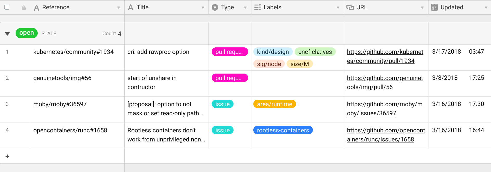

<!-- @format -->

# gitable-node

Bot to automatically sync and update an [Airtable](https://airtable.com) sheet with GitHub pull request and issue data. A [Node.js](https://nodejs.org) port of <https://github.com/jessfraz/gitable>.

## Installation

You'll need a GitHub personal access token and Airtable API key.

#### Getting an Airtable `base_id` and table name

[Follow this guide on Airtable](https://help.grow.com/hc/en-us/articles/360015095834-Airtable#How-to-connect)

#### Via NPM

```bash
$ git clone https://github.com/bih/gitable-node.git
$ cd gitable-node/
$ npm install
$ npm run build
$ npm run cli --help # runs the cli
```

#### Via Yarn

```bash
$ git clone https://github.com/bih/gitable-node.git
$ cd gitable-node/
$ yarn install
$ yarn build
$ yarn cli --help # runs the cli
```

## Usage

```console
$ yarn cli --help
Usage: gitable-node [options] [command]

Synchronize GitHub Issues and Airtable (via Node.js)

Options:
  -v, --version         output the version number
  -h, --help            output usage information

Commands:
  airtable [options]    Synchronize records from Airtable
  github [options]      Synchronize records from GitHub
  cached-run [options]  Run the Airtable sync script (from cache)
  run [options]         A full sync - download from GitHub, and Airtable, and apply changes to Airtable
```

## Requirements

### Airtable Table Structure

In order to use `gitable-node`, your Airtable _must_ have these columns. Additional columns are fine to add although we will leave them empty.

| Field Name  | Type                        | Example / Expected                              | Required     |
| ----------- | --------------------------- | ----------------------------------------------- | ------------ |
| `reference` | `string` (single line text) | `bih/gitable-node#18`                           | **Required** |
| `title`     | `string` (single line text) | `Fix bug with Yarn`                             | **Required** |
| `type`      | `string` (single select)    | `pull request` or `issue`                       | **Required** |
| `state`     | `string` (single line text) | `open` or `closed`                              | **Required** |
| `author`    | `string` (single line text) | `Bilawal Hameed`                                | **Required** |
| `labels`    | `string` (multiple select)  | `bug`, `suggestion` or custom labels            | **Required** |
| `comments`  | `number`                    | `3`                                             | **Required** |
| `url`       | `string` (URL)              | `https://github.com/bih/gitable-node/issues/18` | **Required** |
| `updated`   | `datetime`                  | `2019-07-01 08:13:00 GMT+0000`                  | **Required** |
| `created`   | `datetime`                  | `2019-06-28 19:31:33 GMT+0000`                  | **Required** |
| `completed` | `datetime`                  | `2019-07-01 08:01:00 GMT+0000`                  | **Required** |
| `project`   | `string` (single line text) | `gitable-node`                                  | **Required** |

It should look like the following:



## Global Usage

First you'll need to generate a config and fill out the details:

```bash
$ yarn cli run --config ~/.gitable-node.config.json # It will fail, and generate a config for you.
$ vim ~/.gitable-node.config.json
$ yarn cli run --config ~/.gitable-node.config.json # Run it again, and it'll work.
```

## Update to new version

To update to the newest version, run the following commands:

```bash
$ git pull origin master
$ yarn build
```

Then you can run the `yarn cli run` command again.

## Contributing

This is infrequently maintained, and was used for work purposes.

- [ ] Write tests
- [ ] Write contributing guide
